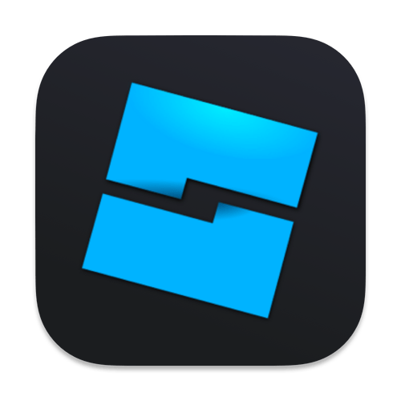
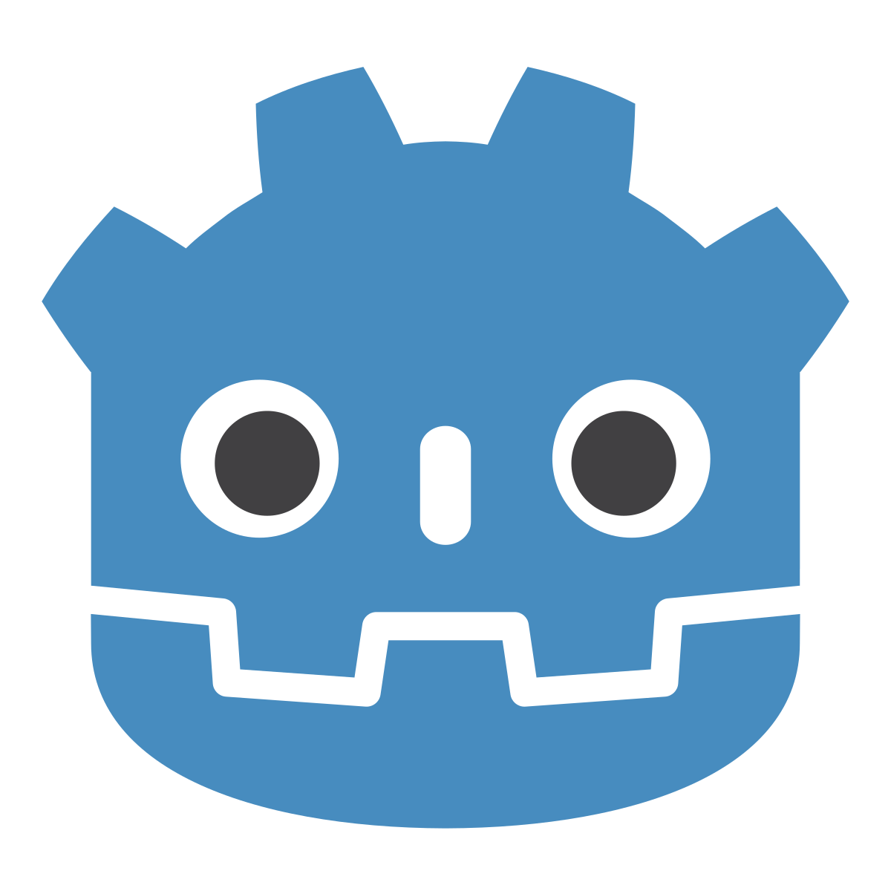

# Stefan Lucas

Instrutor de Tecnologia da Informação no SENAI, desenvolvedor web e desenvolvedor de jogos.

---

## Sobre mim
Bacharel em Ciência da Computação e Especialista em Desenvolvimento de Jogos, atualmente atuo como **Instrutor de TI no SENAI**, trabalhando com formação técnica em informática, programação, desenvolvimento de jogos e desenvolvimento de sistemas.  
Sou desenvolvedor com foco em **aplicações web**, **automação** e **jogos digitais**, unindo prática de mercado com ensino técnico.

Tenho experiência em projetos educacionais, autorais e experimentais, utilizando tecnologias modernas tanto no backend quanto no desenvolvimento de jogos.

---

## Áreas de Atuação
- Desenvolvimento Web
- Desenvolvimento de Jogos
- Automação de Processos
- APIs REST
- Projetos Educacionais em TI

---

## Atividade no GitHub

---

## Tecnologias e Ferramentas

### Web

### Mobile

### Backend

### Game Development

### Design e Arte

---

## Projetos em Destaque

    
    <h3>O TFAN Studios é uma plataforma de jogos autorais onde são publicados projetos desenvolvidos pelo autor e compilados na Unity para HTML5 / WebGL. Os jogos são disponibilizados gratuitamente, permitindo que qualquer pessoa jogue diretamente pelo navegador, sem necessidade de instalação.</h3>

---

    
    <h3>Aplicação em Electron que automatiza o cadastro de planos de aula no sistema do SENAI. O professor seleciona a turma e a disciplina, importa uma planilha XLSX e o sistema copia automaticamente as informações para a plataforma, reduzindo trabalho manual e erros.</h3>

---

    
    <h3>Projeto ElectronJS que simula um SO para uma raspberry pi 4, como um console de videogames.
    Jogos desenvolvidos pelos alunos na unity compilados para HTML5 / WEBGL.</h3>

---

    
    <h3>Sistema de controle de pontuação dos jogos criados por mim, registrando os pontos dos jogadores em um banco PostgreSQL usando Sequelize e Node.Js.</h3>

---

## Contato e +
Site: https://tfanstudios.com.br  
E-mail: stefan.luks.as@gmail.com  
<a href="https://instagram.com/stefan.luks">
    
    Instagram: @stefan.luks
</a>
 
<a href="https://github.com/stefanluks">
    
    Github: stefanluks
</a>
 
<a href="https://thestefanlucas.itch.io/ ">
    
    Jogos Publicados
</a>

