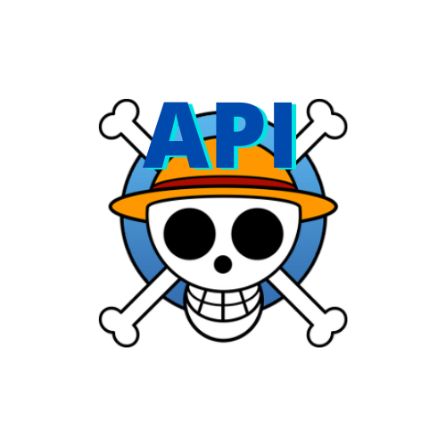
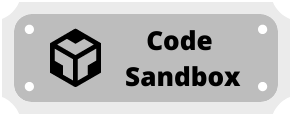

<h1 align="left">Stefan Lucas</h2>

- 📚 Bacharel em Ciência da computação.
- :video_game: Especialista em desenvolvimento de games
- Web and Game FullStack Developer   <a href="https://stefanlucas.com">Portifolio - Stefan Lucas</a>
- e-mail: stefan@stefanlucas.com

  <h3>Principais Projetos</h3>
  

    
    
    
  

<h3 align="left">Onde me encontrar:</h3>

  
  
  
  

 

## Minhas Habilidades:

> <h4>Front-End</h4>     

 

> <h4>Linguagens de Programação</h4>             

 

> <h4>Frameworks</h4>    

 

> <h4>Ferramentas</h4>   

