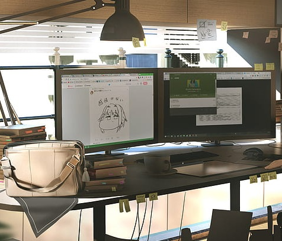

<h2 align="center">Olá, eu sou Stefan Lucas</h2>

- 📚 Acadêmico de Ciência da computação.
- 📚 Estudando **React, Node.JS e C#**
- :video_game: Apaixonado por Game Designer 

  <h3>Alguns de Meus Projetos</h3>
  

    
    
    
  

<h3 align="left">Onde me encontrar:</h3>

  
  
  
  
  

<h3>Minhas habilidades:</h3>

  
  
  
  
  
  
  
  
  
  

