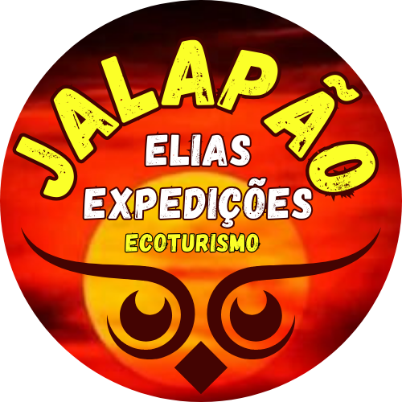

## Stefan Lucas
Especialista em desenvolvimento de jogos 
Bacharel em Ciência da computação
 
<a href="https://stefanluks.github.io/portifolio/">📌 Portifolio Online</a> 
<a href="/arquivos/curriculo.pdf">📃 Curriculo</a>

---

### Habilidades

---

### Principais Projetos

