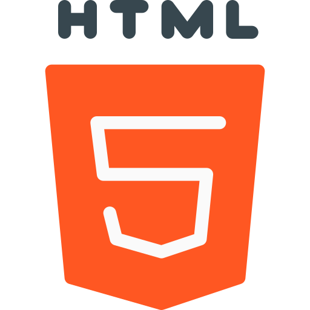
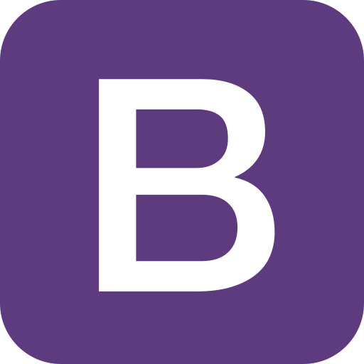
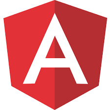
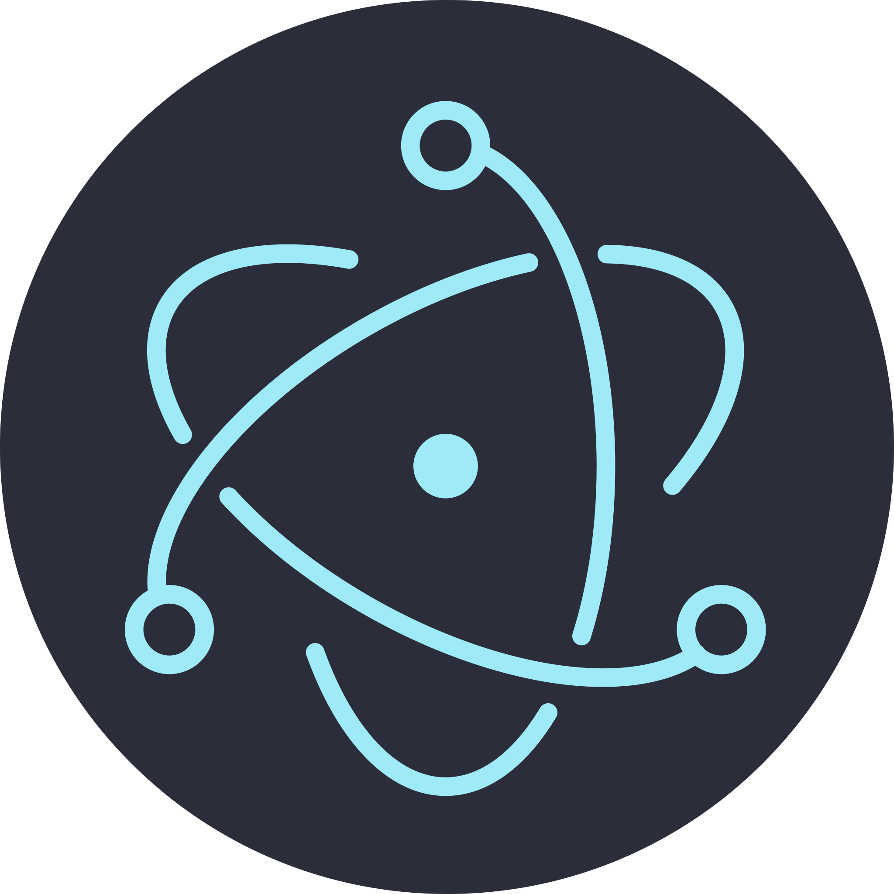
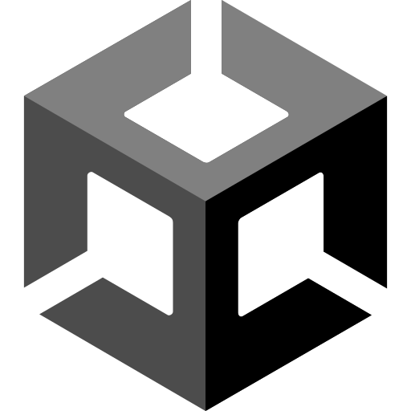
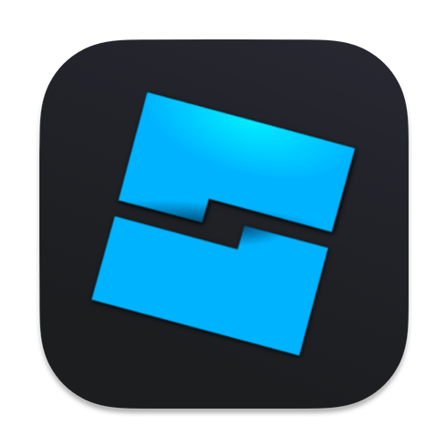
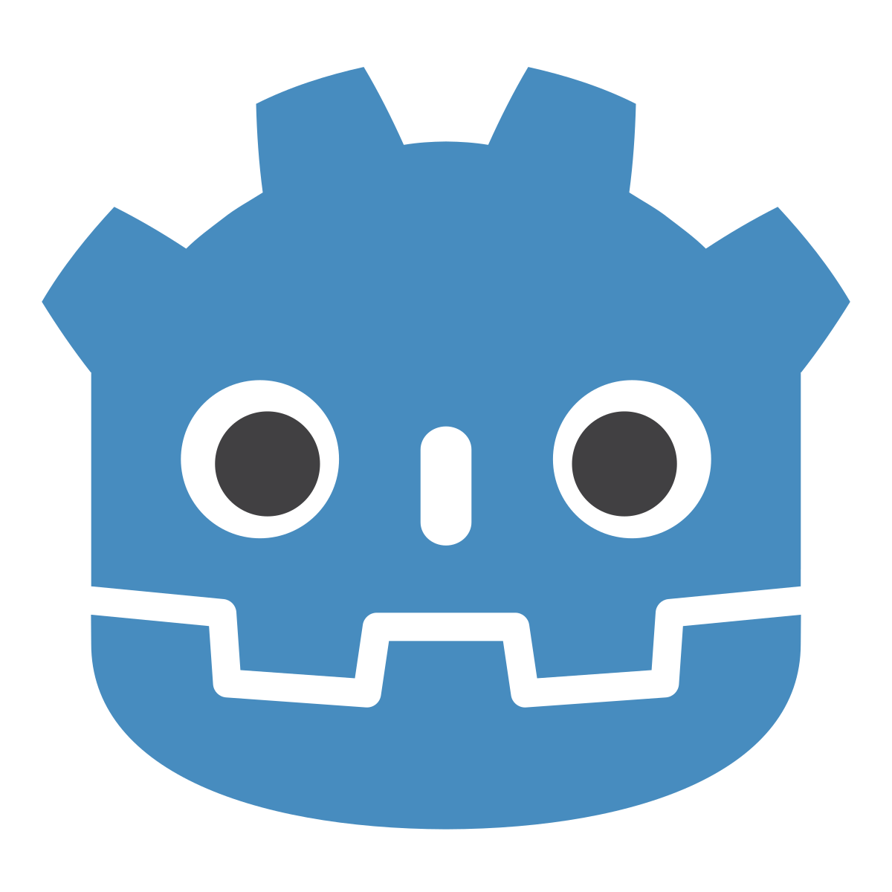
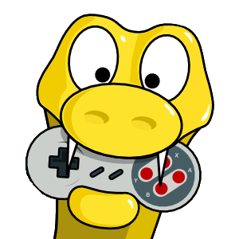
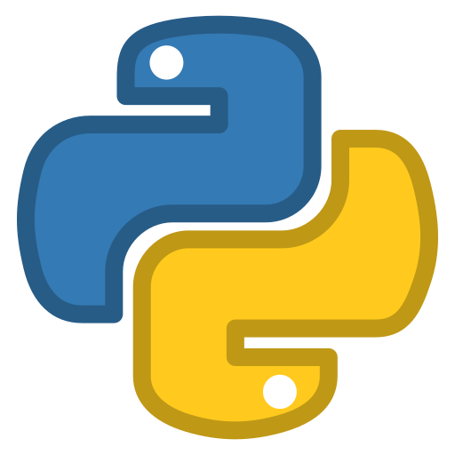
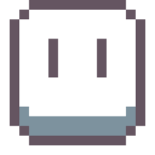

# Stefan Lucas

Desenvolvedor web e desenvolvedor de jogos. 
Instrutor de Tecnologia da Informação no SENAI. 
Professor dos Cursos de Ciência da Computação e Engenharia de Software na Ulbra Palmas.

---

## Sobre mim
Bacharel em Ciência da Computação e Especialista em Desenvolvimento de Jogos, atualmente atuo como **Instrutor de TI no SENAI**, trabalhando com formação técnica em informática, programação, desenvolvimento de jogos e desenvolvimento de sistemas.  
Sou desenvolvedor com foco em **aplicações web**, **automação** e **jogos digitais**, unindo prática de mercado com ensino técnico.

Tenho experiência em projetos educacionais, autorais e experimentais, utilizando tecnologias modernas tanto no backend quanto no desenvolvimento de jogos.

---

## Áreas de Atuação
- Desenvolvimento Web
- Desenvolvimento de Jogos
- Automação de Processos
- APIs REST
- Projetos Educacionais em TI

---

## Atividade no GitHub

---

## Tecnologias e Ferramentas

<table>
  <tr>
    <th>Web</th>
    <th>Mobile</th>
    <th>Game Development</th>
  </tr>
  <tr>
    <td>
      
      
      
      
      
      
      
    </td>
    <td>
      
      
    </td>
    <td>
      
      
      
      
    </td>
  </tr>
</table>

 

<table>
  <tr>
    <th>Backend</th>
    <th>Design e Arte</th>
  </tr>
  <tr>
    <td>
      
      
      
      
      
    </td>
    <td>
      
      
      
    </td>
  </tr>
</table>

---

## Contato e +
Site: https://tfanstudios.com.br  
E-mail: stefan.luks.as@gmail.com  

<a href="https://instagram.com/stefan.luks">
    
    Instagram: @stefan.luks
</a>
 
<a href="https://stefanlucas.com.br/ ">
    
    Meu Portifolio
</a>
 
<a href="https://tfanstudios.com.br/ ">
    
    Meu Studio
</a>
 
<a href="https://thestefanlucas.itch.io/ ">
    
    Jogos Publicados
</a>

